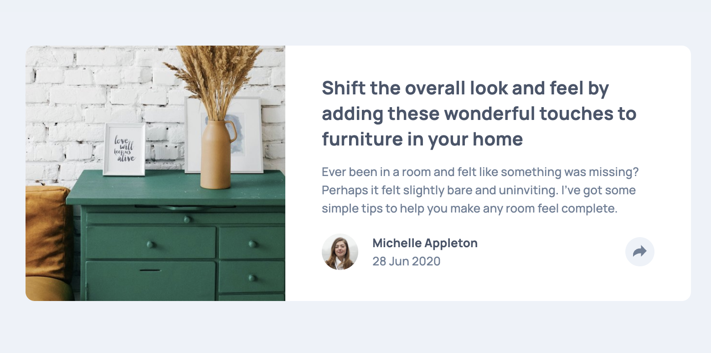

# Frontend Mentor - Article preview component solution

This is a solution to the [Article preview component challenge on Frontend Mentor](https://www.frontendmentor.io/challenges/article-preview-component-dYBN_pYFT). Frontend Mentor challenges help you improve your coding skills by building realistic projects. 

## Table of contents

- [Overview](#overview)
  - [The challenge](#the-challenge)
  - [Screenshot](#screenshot)
  - [Links](#links)
- [My process](#my-process)
  - [Built with](#built-with)
  - [What I learned](#what-i-learned)
  - [Continued development](#continued-development)
  - [Useful resources](#useful-resources)
- [Author](#author)

## Overview

### The challenge

Users should be able to:

- View the optimal layout for the component depending on their device's screen size
- See the social media share links when they click the share icon

### Screenshot

### Links

- [Solution URL](https://github.com/edpau/fm_article-preview-component)
- [Live Site URL](https://edpau.github.io/fm_article-preview-component/)

## My process

### Built with

- Semantic HTML5 markup
- CSS Grid
- CSS Flexbox
- CSS BEM
- Mobile-first workflow

**Note: These are just examples. Delete this note and replace the list above with your own choices**

### What I learned

#### use data-state to manage the interactive state of share button and share navigation menu
- the shareNav, shareButton, and shareButtonIcon elements have their data-state set to "collapsed." 
- When the user clicks the share button, the event listener checks the current value of the data-state attribute and toggles it between "collapsed" and "expanded." This allows for a smooth transition between the two states.

#### use aria-expanded attribute on the share button
- improve accessibility, letting screen readers know if the navigation menu is expanded or collapsed. 

### Continued development

- Ensure proper focus management
- Keyboard accessibility:

### Useful resources

- [Practical Guide on Implementing ‘aria-expanded’ in Web Development](https://www.a11y-collective.com/blog/aria-expanded/) - detail explanation on how the aria-expanded attribute works. Explain relationship between aria-expanded and other ARIA attributes, aria-controls and aria-haspopup.
- [Popups, dialogs, tooltips, and popovers— UX Patterns #2](https://medium.com/design-bootcamp/popups-dialogs-tooltips-and-popovers-ux-patterns-2-939da7a1ddcd) - Explain the difference of popups, dialogs, tooltips, and popovers and when to use which one.
- [Why are some animations slow?](https://web.dev/articles/animations-overview) - Deep article on CSS animations

## Author

- Website - [Edward Pau](https://www.edpau.me)
- Frontend Mentor - [@edpau](https://www.frontendmentor.io/profile/edpau)
